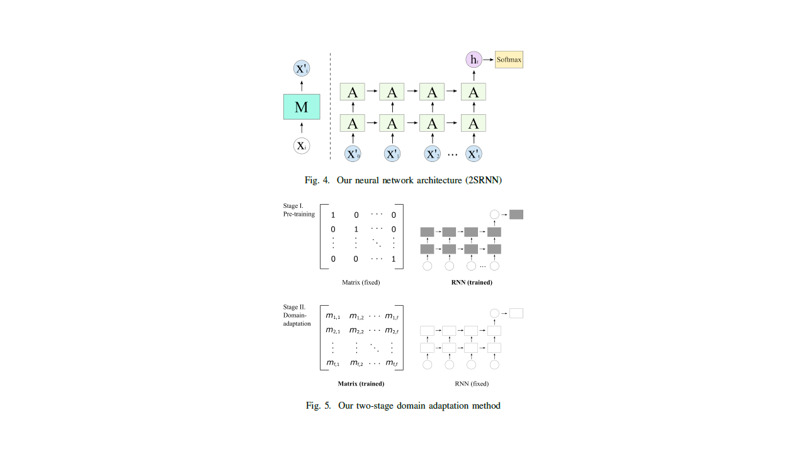

# 2SRNN

Domain Adaption for sEMG-based Gesture Recognition with Recurrent Neural Networks

This is the source code of our 2-Stage Recurrent Neural Network (2SRNN) domain adaptation model in the publication (https://arxiv.org/abs/1901.06958) published at IJCNN 2019 (https://doi.org/10.1109/ijcnn.2019.8852018).

